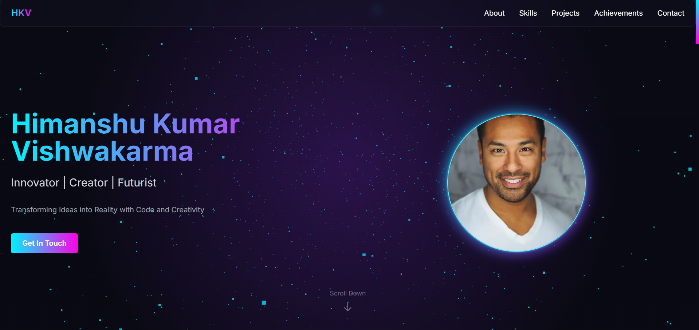

# Himanshu | Cyberpunk Portfolio



## 🚀 About the Project
Welcome to my futuristic **neon cyberpunk-themed portfolio website**, built using **Next.js, Tailwind CSS, and Framer Motion**. This interactive and visually immersive site showcases my work, skills, and projects in a **glowing, holographic UI** with dynamic transitions and 3D elements.

## ✨ Features
- **Holographic Cityscape Homepage** 🏙️
- **Floating UI Cards with Glassmorphism** 🔲
- **Animated Skill Meters** 📊
- **Real-time Project Showcase** 🚀
- **Interactive Terminal-style Contact Form** 💬
- **WebGL Particle Effects** ✨
- **GSAP-powered Dynamic Transitions** ⚡
- **Three.js for 3D Interactive Visuals** 🎮
- **Fully Responsive & Optimized for SEO** 📱

## 🛠️ Tech Stack
- **Framework:** Next.js
- **Styling:** Tailwind CSS, Glassmorphism
- **Animations:** Framer Motion, GSAP
- **3D Graphics:** Three.js, WebGL
- **Deployment:** Vercel

## 📂 Installation & Setup
1. Clone the repository:
   ```bash
   git clone https://github.com/whitedevil9911/Himanshu-futurestic-portfolio.git
   cd portfolio
   ```
2. Install dependencies:
   ```bash
   npm install
   ```
3. Run the development server:
   ```bash
   npm run dev
   ```
4. Open `http://localhost:3000` in your browser.

## 🚀 Deployment
Deployed on **Vercel** for seamless performance and fast loading.
To deploy, run:
```bash
vercel --prod
```

## 📬 Contact
Feel free to reach out for collaborations, projects, or discussions:
- **Portfolio:** [himanshu.dev](https://himanshu.dev)
- **Email:** himanshu160204@gmail.com
- **LinkedIn:** [linkedin.com/in/himanshu-kumar-vishwakrma-56a7b2188/](https://www.linkedin.com/in/himanshu-kumar-vishwakrma-56a7b2188/)

## 📜 License
This project is **MIT Licensed**. Feel free to use and modify!

---
🚀 **Crafted with passion by Himanshu Kumar Vishwakarma** ✨

